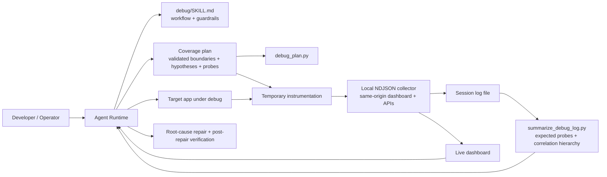
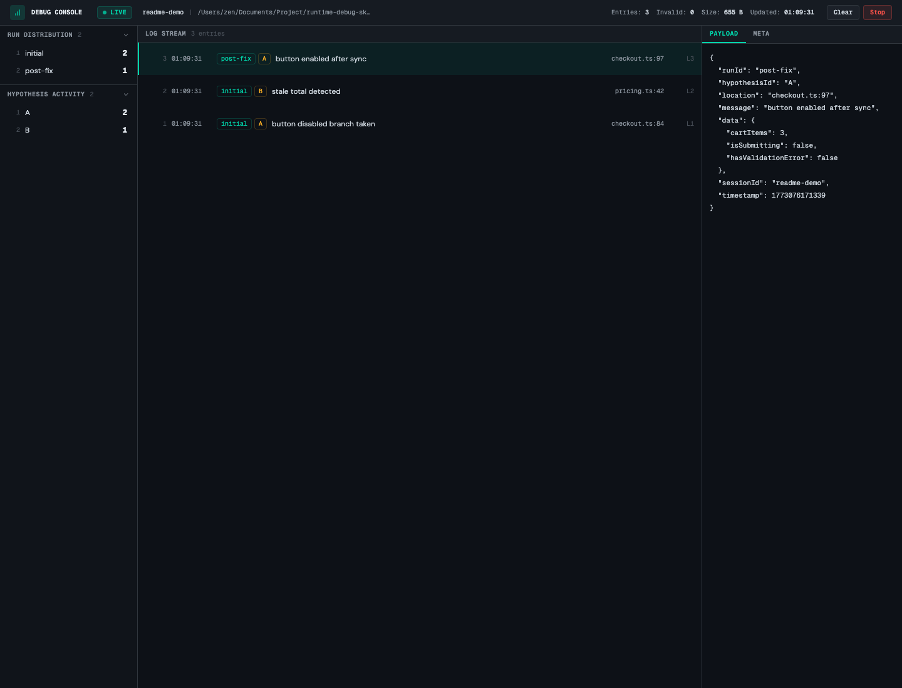

# JUNERDD Skills

<p align="center">
  
</p>

Reusable AI agent skills published from a single repository.

Current collection version: [`0.2.8`](./VERSION). Release notes are tracked in [`CHANGELOG.md`](./CHANGELOG.md) and published through GitHub Releases.

This repository is a skill collection, not a single-skill package. Installable skills live under [`skills/`](./skills/), and each subfolder is meant to be independently installable and expanded over time. The root [`VERSION`](./VERSION) file tracks the published version of the collection as a whole using SemVer; Git tags and GitHub Releases use the `vX.Y.Z` form. Individual tools or subpackages may keep their own runtime versions when needed.

Stable production URL: [https://junerdd-skills.vercel.app](https://junerdd-skills.vercel.app)

## Website (Vercel)

The companion landing page is a Next.js app in [`web/`](./web/).
English is served from unprefixed paths such as `/` and `/skills/<slug>`;
Chinese is served from `/zh-CN` and `/zh-CN/skills/<slug>`.

1. In the [Vercel dashboard](https://vercel.com/new), import this GitHub repository.
2. Under **Configure Project**, set **Root Directory** to **`web`** (critical for this monorepo layout).
3. Add **Environment Variable** on **Production**: **`NEXT_PUBLIC_SITE_URL`** = your production domain (example: `https://skills.example.com`, no trailing slash). This should match the **primary Production domain** configured under **Project → Settings → Domains** so Open Graph, canonical URLs, `sitemap.xml`, and `robots.txt` stay consistent.
4. After the first successful Production deployment, open your GitHub repo **Settings → General** and set **Website** to that same production URL so the repository “About” box links to the live site.

## 🧭 Skills At A Glance

If you are deciding what to install, start here:

- [`comment-strategist`](#comment-strategist) - add high-value code comments without comment noise
- [`exhaustive-code-slimmer`](#exhaustive-code-slimmer) - exhaustively reduce maintained code while preserving behavior
- [`reduce-reinvention`](#reduce-reinvention) - find duplicated effort and guide reuse-first consolidation
- [`find-local-skill`](#find-local-skill) - decompose requests, then find relevant local skills
- [`git-commit`](#git-commit) - draft a Conventional Commit message from the staged diff
- [`mr`](#mr) - use and maintain the Git MR/PR helper CLI
- [`split-commits`](#split-commits) - split a mixed working tree into focused local commits
- [`multitask-coordinator`](#multitask-coordinator) - coordinate multi-step work with hierarchical task and decision ownership
- [`delegate-to-cursor-sdk`](#delegate-to-cursor-sdk) - route bounded work through cursor-delegate with reviewed packets and owned cleanup
- [`plan-mode`](#plan-mode) - plan complex or risky work before editing
- [`debug`](#debug) - prove, repair, and separately verify runtime bugs with a validated coverage plan
- [`code-review`](#code-review) - run product-grounded deep reviews with bounded report lineage
- [`thermo-review`](#thermo-review) - write harsh structural quality review reports
- [`receiving-thermo-review`](#receiving-thermo-review) - consume thermo reports and verify structural plus behavior-parity items
- [`receiving-code-review`](#receiving-code-review) - trace findings end to end, preserve intent, and resolve confirmed items without recursive review loops
- [`hack-review`](#hack-review) - review whether an implementation relies on brittle hack-like shortcuts
- [`receiving-hack-review`](#receiving-hack-review) - consume a hack-review report and verify each finding before changing code
- [`regression-review`](#regression-review) - review code changes for user-visible behavioral regressions
- [`receiving-regression-review`](#receiving-regression-review) - consume a regression-review report and verify each finding before changing code

## 📦 Install

If you want an agent to install this repository for you without copying files, tell it:

```text
Fetch and follow instructions from https://raw.githubusercontent.com/JUNERDD/skills/refs/heads/main/docs/INSTALL.md
```

If the agent already has this repository open locally, it can read [`./docs/INSTALL.md`](./docs/INSTALL.md) directly instead of fetching the raw GitHub URL.

The CLI examples below intentionally use the latest `skills` tool version to avoid mismatches with older local installs.

List the skills currently published from this repository:

```bash
npx skills@latest add JUNERDD/skills --list
```

Install a specific skill:

```bash
npx skills@latest add JUNERDD/skills --skill <skill-name>
```

Install globally for Codex:

```bash
npx skills@latest add JUNERDD/skills --skill <skill-name> -g -a codex -y
```

Examples:

```bash
npx skills@latest add JUNERDD/skills --skill debug
npx skills@latest add JUNERDD/skills --skill git-commit
npx skills@latest add JUNERDD/skills --skill mr
npx skills@latest add JUNERDD/skills --skill split-commits
npx skills@latest add JUNERDD/skills --skill multitask-coordinator
npx skills@latest add JUNERDD/skills --skill delegate-to-cursor-sdk
npx skills@latest add JUNERDD/skills --skill plan-mode
npx skills@latest add JUNERDD/skills --skill comment-strategist
npx skills@latest add JUNERDD/skills --skill exhaustive-code-slimmer
npx skills@latest add JUNERDD/skills --skill reduce-reinvention
npx skills@latest add JUNERDD/skills --skill find-local-skill
npx skills@latest add JUNERDD/skills --skill code-review
npx skills@latest add JUNERDD/skills --skill thermo-review
npx skills@latest add JUNERDD/skills --skill receiving-thermo-review
npx skills@latest add JUNERDD/skills --skill receiving-code-review
npx skills@latest add JUNERDD/skills --skill hack-review
npx skills@latest add JUNERDD/skills --skill receiving-hack-review
npx skills@latest add JUNERDD/skills --skill regression-review
npx skills@latest add JUNERDD/skills --skill receiving-regression-review
```

Manual symlink install still works if you prefer not to use the agent prompt:

```bash
mkdir -p ~/.agents/skills
ln -s "$PWD/skills" ~/.agents/skills/junerdd-skill
```

## 🧱 Repository Model

- The collection version lives in the root [`VERSION`](./VERSION) file.
- Release notes live in [`CHANGELOG.md`](./CHANGELOG.md), and published GitHub releases should use matching `vX.Y.Z` tags.
- Use the release workflow to prepare a collection release. It opens a release PR that updates `VERSION`, the README version line, website version metadata, and `CHANGELOG.md` from one workflow input; merging that PR publishes the matching GitHub Release.
- Each installable skill lives under `skills/<skill-name>/`.
- Each skill owns its own `SKILL.md` plus any optional `agents/`, `references/`, `scripts/`, or `assets/` directories.
- Root-level files describe the repository as a collection. Skill-specific behavior and deep operational details stay inside the relevant skill folder.
- Shared repository assets such as screenshots can live outside `skills/` when they are not part of the installable package itself.

## 🗂️ Current Skills

Use the anchor list above for a quick jump, then read the section that matches your task.

### `comment-strategist`

[`skills/comment-strategist/`](./skills/comment-strategist/) is for documenting existing code without adding low-value comment noise. It focuses on intent, contracts, constraints, field meaning, and control-flow rationale instead of rewriting syntax in prose.

Install:

```bash
npx skills@latest add JUNERDD/skills --skill comment-strategist
```

Best for:

- documenting exported functions, interfaces, classes, and config objects
- replacing outdated or redundant comments with durable explanations
- adding guided comments inside complex logic while preserving the local comment style

Key entry points:

- Workflow and guardrails: [`skills/comment-strategist/SKILL.md`](./skills/comment-strategist/SKILL.md)
- Optional runtime metadata: [`skills/comment-strategist/agents/openai.yaml`](./skills/comment-strategist/agents/openai.yaml)

### `exhaustive-code-slimmer`

[`skills/exhaustive-code-slimmer/`](./skills/exhaustive-code-slimmer/) exhaustively searches for behavior-preserving code reductions. It combines audit scripts, deletion-first candidate search, oracle design, and an approval gate for architecture-level refactors so slimming improves maintainability instead of producing dense or risky code. Invocation is explicit-only: a user must invoke `$exhaustive-code-slimmer`; matching prompts do not activate it automatically.

Install:

```bash
npx skills@latest add JUNERDD/skills --skill exhaustive-code-slimmer
```

Best for:

- finding removable files, branches, exports, dependencies, wrappers, and duplicate logic
- running deletion candidates against a build/test/lint/smoke oracle before accepting changes
- identifying architecture problems that block safe code reduction and presenting DX-oriented options before refactoring

Key entry points:

- Workflow and guardrails: [`skills/exhaustive-code-slimmer/SKILL.md`](./skills/exhaustive-code-slimmer/SKILL.md)
- Code-slim audit script: [`skills/exhaustive-code-slimmer/scripts/code_slim_audit.py`](./skills/exhaustive-code-slimmer/scripts/code_slim_audit.py)
- Exhaustive shrink script: [`skills/exhaustive-code-slimmer/scripts/exhaustive_shrink.py`](./skills/exhaustive-code-slimmer/scripts/exhaustive_shrink.py)
- Optional runtime metadata: [`skills/exhaustive-code-slimmer/agents/openai.yaml`](./skills/exhaustive-code-slimmer/agents/openai.yaml)

### `reduce-reinvention`

[`skills/reduce-reinvention/`](./skills/reduce-reinvention/) identifies and reduces duplicated effort across code, libraries, services, templates, docs, platform workflows, and architecture decisions. It combines a reuse-first workflow with audit scripts and decision templates so teams can adopt, adapt, consolidate, or justify divergence with evidence.

Install:

```bash
npx skills@latest add JUNERDD/skills --skill reduce-reinvention
```

Best for:

- auditing duplicated implementations and overlapping reusable assets
- deciding build-vs-reuse/buy with ownership, maintenance, security, and migration tradeoffs
- creating reuse catalogs, ADR/RFC records, migration plans, or golden-path guidance

Key entry points:

- Workflow and guardrails: [`skills/reduce-reinvention/SKILL.md`](./skills/reduce-reinvention/SKILL.md)
- Reuse playbook: [`skills/reduce-reinvention/references/reuse-playbook.md`](./skills/reduce-reinvention/references/reuse-playbook.md)
- Audit checklist: [`skills/reduce-reinvention/references/audit-checklist.md`](./skills/reduce-reinvention/references/audit-checklist.md)
- Decision matrix: [`skills/reduce-reinvention/references/decision-matrix.md`](./skills/reduce-reinvention/references/decision-matrix.md)
- Output templates: [`skills/reduce-reinvention/references/templates.md`](./skills/reduce-reinvention/references/templates.md)
- Reinvention audit script: [`skills/reduce-reinvention/scripts/reinvention_audit.py`](./skills/reduce-reinvention/scripts/reinvention_audit.py)
- Reuse catalog script: [`skills/reduce-reinvention/scripts/reuse_catalog.py`](./skills/reduce-reinvention/scripts/reuse_catalog.py)
- Optional runtime metadata: [`skills/reduce-reinvention/agents/openai.yaml`](./skills/reduce-reinvention/agents/openai.yaml)

### `find-local-skill`

[`skills/find-local-skill/`](./skills/find-local-skill/) helps agents decompose a request into deliverables, workflow phases, tools, domains, and implicit prerequisites before inspecting available local skills, selecting the ones that match, and applying those workflows before normal analysis. It includes a local scanner for plain project `skills/` folders, Cursor, Claude Code, OpenCode, Codex, shared Agent Skills roots, and plugin skill caches.

Install:

```bash
npx skills@latest add JUNERDD/skills --skill find-local-skill
```

Best for:

- finding relevant local skills before planning or implementation
- routing ambiguous or multi-phase requests through explicit skill selection
- surfacing implicit prerequisite skills before deeper requirement analysis
- auditing available skill coverage across plain project `skills/`, Cursor, Claude Code, OpenCode, Codex, and shared Agent Skills roots
- distinguishing plugin skills with names such as `product-design:index`

Key entry points:

- Workflow and guardrails: [`skills/find-local-skill/SKILL.md`](./skills/find-local-skill/SKILL.md)
- Local skill scanner: [`skills/find-local-skill/scripts/list_agent_skills.py`](./skills/find-local-skill/scripts/list_agent_skills.py)
- Optional runtime metadata: [`skills/find-local-skill/agents/openai.yaml`](./skills/find-local-skill/agents/openai.yaml)

### `git-commit`

[`skills/git-commit/`](./skills/git-commit/) drafts a Conventional Commit message from the staged diff only. It is intentionally narrow: it reads what is already staged, proposes one accurate message, and does not mutate Git state.

Install:

```bash
npx skills@latest add JUNERDD/skills --skill git-commit
```

Best for:

- generating a clean commit subject from the current index
- checking whether a staged batch is too mixed for one honest commit message
- keeping commit wording grounded in staged files instead of unstaged work

Key entry points:

- Workflow and guardrails: [`skills/git-commit/SKILL.md`](./skills/git-commit/SKILL.md)
- Optional runtime metadata: [`skills/git-commit/agents/openai.yaml`](./skills/git-commit/agents/openai.yaml)

### `mr`

[`skills/mr/`](./skills/mr/) supports the `mr` Node CLI for generic Git MR/PR workflows. It covers target aliases, MR branch strategies, default detached mode, request providers or custom request commands, configuration, conflict resume with configurable detached worktree placement and dependency setup, install/update/uninstall behavior, automatic update notices, and maintenance of the TypeScript CLI implementation behind the tool.

Install:

```bash
npx skills@latest add JUNERDD/skills --skill mr
```

Best for:

- creating or previewing Git merge requests or pull requests with `mr`, `mrm`, `mrt`, or `mrp`
- checking for a missing local `mr` install and installing it after user confirmation
- choosing between `merge`, `rebase`, `merge-target`, `pr`, and default detached-mode flows
- configuring CNB/GitHub/GitLab providers or a custom `mr.requestCommand`
- understanding non-blocking update notices and the environment variables that disable them
- handling stopped merge/rebase states by preserving CLI-owned resume paths, configuring detached conflict worktree placement and IDE worktree detection, and hydrating worktree dependencies
- maintaining the TypeScript/Pastel/Ink/Zod implementation behind the CLI

Key entry points:

- Workflow and guardrails: [`skills/mr/SKILL.md`](./skills/mr/SKILL.md)
- CLI reference: [`skills/mr/references/mr-cli-reference.md`](./skills/mr/references/mr-cli-reference.md)
- Optional runtime metadata: [`skills/mr/agents/openai.yaml`](./skills/mr/agents/openai.yaml)

### `split-commits`

[`skills/split-commits/`](./skills/split-commits/) helps break a mixed working tree into a sequence of focused local commits. It stages one logical batch at a time, asks `$git-commit` for a message, and requires explicit confirmation before each `git commit`.

Install:

```bash
npx skills@latest add JUNERDD/skills --skill split-commits
```

Best for:

- separating unrelated concerns in the same working tree
- isolating refactors from behavior changes
- building a short series of reviewable local commits without pushing

Key entry points:

- Workflow and guardrails: [`skills/split-commits/SKILL.md`](./skills/split-commits/SKILL.md)
- Optional runtime metadata: [`skills/split-commits/agents/openai.yaml`](./skills/split-commits/agents/openai.yaml)

### `multitask-coordinator`

[`skills/multitask-coordinator/`](./skills/multitask-coordinator/) coordinates non-trivial multi-step work with hierarchical, dependency-aware subagent scheduling. The root parent builds a task and decision graph, assigns one owner per decision domain and write boundary, delegates exclusive subtrees to subplanners when justified, materializes owned ephemeral shared memory when hierarchy or context handoffs require it, dispatches ready work event by event, routes conflicts, and integrates evidence into a verified result. Invocation is explicit-only: a user must invoke `$multitask-coordinator`; matching prompts do not activate it automatically.

Install:

```bash
npx skills@latest add JUNERDD/skills --skill multitask-coordinator
```

Best for:

- coordinating parallel and dependent work through an explicit task and decision graph
- delegating independently decomposable decision domains to bounded recursive subplanners
- sharing accepted decisions and handoffs through owned, single-writer ephemeral documents when needed
- preventing decision split-brain, stale contracts, and overlapping writes in large or dirty repositories
- keeping healthy workers uninterrupted while accepted results unlock dependent work
- auditing hierarchical orchestration for ownership drift, uncontrolled recursion, contention, or verification gaps

Key entry points:

- Workflow and guardrails: [`skills/multitask-coordinator/SKILL.md`](./skills/multitask-coordinator/SKILL.md)
- Ephemeral shared memory: [`skills/multitask-coordinator/references/ephemeral-shared-memory.md`](./skills/multitask-coordinator/references/ephemeral-shared-memory.md)
- Scheduler audit: [`skills/multitask-coordinator/references/scheduler-audit.md`](./skills/multitask-coordinator/references/scheduler-audit.md)
- Optional runtime metadata: [`skills/multitask-coordinator/agents/openai.yaml`](./skills/multitask-coordinator/agents/openai.yaml)

### `delegate-to-cursor-sdk`

[`skills/delegate-to-cursor-sdk/`](./skills/delegate-to-cursor-sdk/) routes bounded coding work through the independent `cursor-delegate` CLI with reviewed task packets. The skill owns delegation policy, templates, global authorization barriers, user link handoffs, review, acceptance, and a marker-validated private session for temporary packets/logs, while the separate TypeScript CLI owns all `@cursor/sdk` integration and the packaged Next.js authorization/dashboard frontend. Hierarchical mode adds dependency-aware workstream scheduling, effective-concurrency limits, isolated writers, and integration gates without coupling Cursor runtime code or dependencies into the skill.

Install:

```bash
npx skills@latest add JUNERDD/skills --skill delegate-to-cursor-sdk
```

This installs the skill only. It does not bundle the independent `cursor-delegate` CLI or its `@cursor/sdk` runtime/dependencies, but it does include a Python-standard-library session/lease wrapper for temporary packet and log ownership. Install `cursor-delegate` from its own project first and verify `cursor-delegate --version`.

Best for:

- dispatching bounded implementation, proposal, or inspect-only packets through `delegation_session.py run --session-file ... --log-name ... -- cursor-delegate ...`, with a foreground lease on every run
- using the catalog-resolved Grok 4.5 High non-Fast preset for top-level Cursor runs while treating optional SDK result evidence and internal-subagent model labels without overstating verification
- coordinating independent hierarchical workstreams through a dependency ledger, event-driven readiness, isolated apply-mode writers, and upstream acceptance gates
- having non-root workstreams fail closed on missing authorization, then letting root recursively stop the full descendant tree, start the packaged Next.js frontend/control plane, and present its local authorization URL plus Cursor API Keys together without automatically opening either link before resuming the recorded agents after verification
- allowing Cursor task/Agent-tool subagents only under an explicit packet policy
- monitoring Cursor runs through sanitized `status.json`, including active and recent internal subagents
- following step/turn/request/tool/task progress in a sequence-ordered execution tape whose streamed assistant/reasoning text cannot disappear when shorter terminal payloads arrive, with explicit watermarks and snapshot recovery across bounded replay windows
- reviewing Cursor output, diffs, verification evidence, and repair loops before final acceptance
- keeping copied packets and ordinary skill-managed CLI logs outside the target repository, while explicit `--retained-log-dir` audit logs remain caller-owned and are never cleaned; the marker-owned session is removed only after terminal frontend shutdown and final upstream acceptance or reconciled/user-authorized abandonment

Key entry points:

- Workflow and guardrails: [`skills/delegate-to-cursor-sdk/SKILL.md`](./skills/delegate-to-cursor-sdk/SKILL.md)
- Cursor internal subagent policy: [`skills/delegate-to-cursor-sdk/references/cursor-internal-subagents.md`](./skills/delegate-to-cursor-sdk/references/cursor-internal-subagents.md)
- Task packet templates: [`task-direct.md`](./skills/delegate-to-cursor-sdk/references/task-direct.md), [`task-planned.md`](./skills/delegate-to-cursor-sdk/references/task-planned.md), [`task-local.md`](./skills/delegate-to-cursor-sdk/references/task-local.md), [`task-user-plan.md`](./skills/delegate-to-cursor-sdk/references/task-user-plan.md), [`task-follow-up.md`](./skills/delegate-to-cursor-sdk/references/task-follow-up.md)
- Independent CLI contract: [`skills/delegate-to-cursor-sdk/references/cursor-delegate-cli-reference.md`](./skills/delegate-to-cursor-sdk/references/cursor-delegate-cli-reference.md)
- Temporary-artifact lifecycle and leased dispatch wrapper: [`owned-artifact-cleanup.md`](./skills/delegate-to-cursor-sdk/references/owned-artifact-cleanup.md) and [`delegation_session.py`](./skills/delegate-to-cursor-sdk/scripts/delegation_session.py)
- Optional runtime metadata: [`skills/delegate-to-cursor-sdk/agents/openai.yaml`](./skills/delegate-to-cursor-sdk/agents/openai.yaml)

### `plan-mode`

[`skills/plan-mode/`](./skills/plan-mode/) mirrors Cursor's Plan Mode loop for complex, ambiguous, risky, or multi-file work: create a disk-backed editable Markdown plan, research the codebase into file/code references, ask focused clarification questions, maintain buildable todos, pressure-test non-trivial plans with `$grill-me`, and build only after the plan is approved.

Install:

```bash
npx skills@latest add JUNERDD/skills --skill plan-mode
```

Best for:

- planning implementation for broad or multi-file tasks before editing
- tracing routes, data flow, architecture constraints, tradeoffs, or risky operations
- maintaining an editable plan document with file references and checkbox todos
- invoking `$grill-me` to pressure-test meaningful assumptions, risks, and rollout edges
- building all or selected todos only after the user approves the plan

Key entry points:

- Workflow and guardrails: [`skills/plan-mode/SKILL.md`](./skills/plan-mode/SKILL.md)
- Plan artifact helper: [`skills/plan-mode/scripts/plan_artifact.py`](./skills/plan-mode/scripts/plan_artifact.py)
- Architecture reference: [`skills/plan-mode/references/architecture.md`](./skills/plan-mode/references/architecture.md)
- Optional runtime metadata: [`skills/plan-mode/agents/openai.yaml`](./skills/plan-mode/agents/openai.yaml)

### `debug`

[`skills/debug/`](./skills/debug/) provides coverage-first, end-to-end runtime debugging and repair for application bugs, regressions, flaky or expensive reproductions, long-lived real-time streams, and unclear failures. It builds a code-grounded causal map, validates one machine-readable hypothesis-and-probe plan, maximizes discriminating evidence from the first failing reproduction or bounded observation window, proves the origin-to-symptom chain, repairs the causal mechanism, verifies the original failure contract in a separate run, and cleans up temporary instrumentation. Requests to debug, troubleshoot, fix, repair, or resolve follow this full loop unless the user explicitly asks for diagnosis-only work. Each runtime run uses a user handoff by default. A pre-run assignment of the runtime investigation may select an autonomous agent chain, but asking the agent to investigate after a completed user run resumes evidence analysis without relabeling that run or transferring future reproduction ownership; a future run changes owner only through explicit run-scoped delegation. Lifecycle scope is explicit: one investigation and ledger may contain one or more collector sessions, and each collector session may contain multiple run IDs. Across user replies, evidence analysis, context compaction, repair, and new runs, the agent resumes the ledger's exact active ready file and reuses every healthy collector and dashboard instead of creating another port or UI. Browser-capable local sessions automatically attempt to open and confirm the bundled dashboard with bounded fallback attempts only when first established; user-owned reproduction never disables that default, and only a verified no-local-GUI host opts out. Every active probe occurrence becomes exactly one independent logical event through an acknowledged persistence checkpoint; browser wire batching changes request framing only, never event count.

Install:

```bash
npx skills@latest add JUNERDD/skills --skill debug
```

Key entry points:

- Workflow and guardrails: [`skills/debug/SKILL.md`](./skills/debug/SKILL.md)
- Coverage-first planning: [`skills/debug/references/coverage-first-debugging.md`](./skills/debug/references/coverage-first-debugging.md)
- Operator reference: [`skills/debug/references/runtime-debugging.md`](./skills/debug/references/runtime-debugging.md)
- Browser and streaming instrumentation: [`skills/debug/references/browser-debugging.md`](./skills/debug/references/browser-debugging.md)
- Root-cause report rules: [`skills/debug/references/root-cause-document.md`](./skills/debug/references/root-cause-document.md)
- Coverage-plan validator: [`skills/debug/scripts/debug_plan.py`](./skills/debug/scripts/debug_plan.py)
- Browser instrumentation validator: [`skills/debug/scripts/validate_browser_instrumentation.py`](./skills/debug/scripts/validate_browser_instrumentation.py)
- Session helper for start, exact-ready-file resume, status, and cleanup: [`skills/debug/scripts/debug_session.py`](./skills/debug/scripts/debug_session.py)
- Registry-owned page-local browser transport: [`skills/debug/assets/browser-debug-transport.mjs`](./skills/debug/assets/browser-debug-transport.mjs)
- Log summarizer: [`skills/debug/scripts/summarize_debug_log.py`](./skills/debug/scripts/summarize_debug_log.py)
- Local NDJSON collector: [`skills/debug/scripts/local_log_collector/`](./skills/debug/scripts/local_log_collector/)
- Lifecycle regression tests: [`skills/debug/scripts/test_debug_tools.py`](./skills/debug/scripts/test_debug_tools.py)
- Coverage-plan regression tests: [`skills/debug/scripts/test_debug_plan.py`](./skills/debug/scripts/test_debug_plan.py)
- Dashboard summary regression tests: [`skills/debug/scripts/test_dashboard_utils.mjs`](./skills/debug/scripts/test_dashboard_utils.mjs)
- Browser transport regression tests: [`skills/debug/scripts/test_browser_debug_transport.mjs`](./skills/debug/scripts/test_browser_debug_transport.mjs)
- Browser instrumentation validator tests: [`skills/debug/scripts/test_validate_browser_instrumentation.py`](./skills/debug/scripts/test_validate_browser_instrumentation.py)
- Optional runtime metadata: [`skills/debug/agents/openai.yaml`](./skills/debug/agents/openai.yaml)

### `debug` Skill Snapshot

The `debug` skill is designed to prevent speculative fixes by forcing a prove-it loop:

1. Resolve scope without redundant approval: debug/fix requests run through repair and verification, while explicitly diagnosis-only requests stop before behavior changes. Default each run to a user handoff; before the first run, an explicit agent assignment may cover the remaining autonomous chain, while later ownership changes require explicit delegation of the applicable future run.
2. Define the failure contract and terminal or long-lived observation condition, inspect the execution path, and build a causal-boundary map.
3. Enumerate code-grounded material hypotheses and map both confirming and rejecting evidence to shared probes.
4. Validate one coverage-plan file with a flow-start plus configured terminal or observation-checkpoint sentinel, a fixed `all-occurrences` / `every-execution` cardinality contract, and structured payload-only bounds for every probe, then use it for location sync and expected-probe analysis.
5. Resume the current investigation's exact ready file before any start attempt. Reuse a healthy collector and existing dashboard across turns and run IDs without scanning the workspace or reopening UI; start a collector only when none is recorded, the recorded session is missing or unreachable, or the user or host explicitly requires isolation or replacement. Newly established browser-capable local sessions automatically attempt to open and confirm the dashboard; only a verified host without a usable local graphical browser opts out.
6. Pass compile, payload-cost, privacy, correlation, browser-instrumentation, transport-continuity, and collector gates; every active probe occurrence must remain a distinct queued and persisted record, while continuous streams prove an acknowledged event prefix without waiting for the live queue to become empty. Before the next pass, remove superseded debug logging and breakpoints, clear stale collector evidence, run `debug_session.py dashboard-status`, use `resume-recording` if recording is frozen, and copy the refreshed live status/URL line before every user-owned reproduction.
7. Collect one clean terminal run or bounded observation window, summarize source and transport sequence continuity by run and correlation hierarchy, and classify every hypothesis.
8. Prove origin, propagation, and symptom or add only probes for the smallest unresolved interval; keep one evolving ledger through every material transition.
9. For diagnosis-only work, preserve evidence and remove temporary probes, debug logs, and breakpoints before reporting; otherwise treat the root-cause result as intermediate, repair the causal mechanism immediately, verify separately, then remove temporary instrumentation and clear or stop owned logging artifacts.

This keeps the skill focused on evidence while carrying normal debug requests through a verified repair instead of stopping at a diagnosis.

### `debug` Architecture



### `debug` Highlights

- Evidence-first debugging instead of inspection-only reasoning
- One coverage-first workflow whose breadth scales with reproduction cost and observer risk
- One closed-schema, machine-validated coverage plan shared by location sync and expected-probe analysis, plus mandatory semantic contradiction review so descriptive prose cannot become a second occurrence policy
- High-information instrumentation with payload-only cost controls, all-occurrence event cardinality, and explicit cleanup after diagnosis-only completion or repair verification
- Parent-flow, operation, request, child-correlation, and run-aware log analysis
- One evolving root-cause ledger across evidence collection, repair, verification, and cleanup
- Local collector bootstrap when the host does not already provide logging
- Ledger-first exact-ready-file session resume across user replies, analysis, context compaction, repair, and fresh run IDs, without duplicate ports or dashboard tabs
- Automatic local dashboard startup, bounded confirmation recovery, and a deterministic `dashboard-status` line in every user-owned reproduction handoff
- One mutually exclusive Freeze/Resume control backed by a collector-global recording gate: `FROZEN` discards new events instead of writing them, while every dashboard keeps refreshing and Clear remains available
- Scannable Markdown handoffs for user-owned reproduction, evidence analysis, and repair verification, with blank-line-separated headings and lists
- Readable dashboard summaries that prefer optional human messages and fall back to structured event names or probe IDs without rewriting raw evidence
- Mandatory realm-registry-owned browser transport plus conflict-on-active, release-then-reacquire HMR producer leases, all-occurrence capture, strict full-request byte frames, idempotent persistence acknowledgement, audited run terminalization, and explicit lifecycle-loss boundaries
- Conservative browser-instrumentation validation that masks comments, strings, templates, and classified regex literals, fails closed when slash/brace syntax is ambiguous, requires one top-level canonical transport binding, and rejects direct or variable-aliased ingestion fetches, steady `keepalive: true`, silent catches, copied-but-unused transports, duplicate factories, shadowed or fake sinks, and common occurrence gates; runtime cardinality reconciliation remains mandatory
- Explicit prohibition on app-local proxy routes unless direct browser-to-collector delivery is proven blocked

### `debug` Runtime Support

The current `debug` skill is intentionally portable. The bundled coverage validator, session helper, summarizer, and collector use Python 3; an authoritative host session may provide equivalent evidence operations, but the coverage-plan gate must still be validated. It works with:

- OpenAI Codex and similar local-skill runtimes
- Agent shells that read `~/.agents/skills/<name>/SKILL.md`
- Custom agent frameworks that mount a skill folder and inject `SKILL.md` into context
- Internal toolchains that want the collector, references, or workflow as reusable assets

If your runtime ignores [`skills/debug/agents/openai.yaml`](./skills/debug/agents/openai.yaml), the core logic is still fully available through [`skills/debug/SKILL.md`](./skills/debug/SKILL.md).

### `debug` Dashboard Preview



### `debug` Collector

The bundled collector is a zero-dependency Python app built on the standard library. While recording is live, it accepts individual or byte-framed batch JSON log events, appends every independently serialized event to its own NDJSON line without an event-count cap, and serves a same-origin dashboard for live inspection. Its single mutually exclusive Freeze/Resume button controls a collector-global recording gate: `Freeze` changes every dashboard to `FROZEN` and discards new events instead of writing them to NDJSON, while the UI continues refreshing and `Clear` and `Stop` remain available. Clear removes existing evidence without resuming recording. Because the collector owns this state, all tabs, page reloads, and later analysis turns that reuse the same collector observe the same gate; `Resume` re-enables writes globally. Any event discarded while frozen makes the run incomplete and is never successful evidence. The log stream prefers the optional human-readable `message`, then falls back to the required structured `event`, then its `probeId`, so valid compact events remain readable without mutating the NDJSON evidence. A batch is only a finite throughput frame: events are queued immediately, remain distinct, retry with the same frame ID, and are deleted only after a persistence acknowledgement. Continuous producers use an acknowledged-prefix checkpoint, while a queue-empty flush is reserved for after production stops. One bounded `/ingest/batch` request may be temporarily pending; multiple simultaneous direct `/ingest` Pending rows from one page are an instrumentation-gate failure. On continuation, `debug_session.py resume --ready-file` validates only the exact active ready file recorded in the investigation ledger; it never scans for another session, starts a collector, or opens UI. A successful resume keeps the same endpoint, port, evidence file, and dashboard across fresh run IDs. A replacement is allowed only when the recorded ready file is missing or unreachable or the user or host explicitly requires isolation or replacement, and the transition stays in the same investigation ledger. Browser-capable local startup automatically attempts to open and confirm the dashboard after HTTP readiness, with at most two fallback attempts. Use `--no-open-dashboard` only when the collector host is verified to have no usable local graphical browser; user-owned reproduction and missing agent browser control are not opt-out reasons, and a failed open never blocks evidence collection. Before every user-owned reproduction, the agent refreshes the active session state, verifies that recording is live, runs `debug_session.py resume-recording --ready-file <READY_FILE>` when necessary, and shows the dashboard status and current URL without reopening a healthy resumed dashboard.

For frontend and browser debugging, acquire exactly one shared bundled client-to-collector transport through `getOrCreateBrowserDebugTransport` per page realm and collector session. Assign that one acquisition directly to a top-level canonical `const`, and expose only narrow event-emitter or producer-install functions to probe sites. HMR reuses the registry-owned queue, releases the current stable producer lease, and then reacquires its inactive control without stacking wrappers, listeners, or timers or resetting source sequence; acquisition while the key is still active is a run-invalidating conflict, never an implicit replacement. Deliberate transport replacement must detach producers and terminalize the old run through `flushAndStop()`; a failed drain remains auditable as incomplete, releases only into a fresh `runId`, and never permits the old and new transports to drain together. Never hand-write fire-and-forget `/ingest` fetches or use steady `keepalive: true`. The collector binds every outer batch ID to the complete canonical frame identity; a conflicting reuse returns a fatal `transport_batch_id_conflict` instead of retrying or claiming persistence. The collector already handles CORS and preflight, so the skill should not create temporary Next.js API routes or other app-local proxy layers unless direct browser delivery has been proven blocked in the current host.

Collector endpoints:

- `POST /ingest`
- `POST /ingest/batch`
- `GET /health`
- `GET /api/state`
- `GET /api/logs`
- `GET /api/logs/detail`
- `POST /api/clear`
- `POST /api/recording/freeze`
- `POST /api/recording/resume`
- `POST /api/shutdown`

Minimal smoke test:

```bash
mkdir -p .debug-logs
python3 skills/debug/scripts/local_log_collector/main.py \
  --log-file "$PWD/.debug-logs/demo.ndjson" \
  --ready-file "$PWD/.debug-logs/demo.json" \
  --session-id "demo-session"
```

### `code-review`

[`skills/code-review/`](./skills/code-review/) turns a generic `/code-review` request into one frozen-scope deep review. It begins with a read-only orchestration assessment, requires authoritative expected-behavior evidence before treating product choices as defects, assigns stable semantic issue fingerprints, and persists a validated lineage-aware report. A receiving workflow may produce one implementation-delta post-review, but that generation is terminal and cannot automatically start another receiving cycle. The skill does not edit code or Git state unless the user separately requests fixes. Invocation is explicit-only: a user must invoke `$code-review`; matching prompts do not activate it automatically.

Install:

```bash
npx skills@latest add JUNERDD/skills --skill code-review
```

Best for:

- reviewing PRs, branch diffs, staged changes, working trees, files, or pasted code
- deciding when parallel specialist subagents add material review value
- surfacing bugs, regressions, security issues, contract risks, and missing tests before merge
- distinguishing verified defects from unconfirmed product intent
- producing a reusable `code-review` artifact with coverage evidence, semantic issue lineage, and a bounded receiving handoff

Key entry points:

- Workflow and guardrails: [`skills/code-review/SKILL.md`](./skills/code-review/SKILL.md)
- Subagent orchestration: [`skills/code-review/references/subagent-orchestration.md`](./skills/code-review/references/subagent-orchestration.md)
- Report template: [`skills/code-review/references/report-template.md`](./skills/code-review/references/report-template.md)
- Report validator: [`skills/code-review/scripts/validate_review_report.py`](./skills/code-review/scripts/validate_review_report.py)
- Validator regression tests: [`skills/code-review/scripts/test_validate_review_report.py`](./skills/code-review/scripts/test_validate_review_report.py)
- Optional runtime metadata: [`skills/code-review/agents/openai.yaml`](./skills/code-review/agents/openai.yaml)

### `thermo-review`

[`skills/thermo-review/`](./skills/thermo-review/) performs an extremely strict structural code-quality review. It writes a Markdown report with a recursive candidate sweep, a 350-line maintained-source trigger for cohesion, dependency, and ownership analysis, severity-ordered maintainability findings, and a quality-gate recommendation while avoiding code changes unless the user explicitly asks for fixes. The threshold drives responsibility-boundary diagnosis rather than text compaction. Invocation is explicit-only: a user must invoke `$thermo-review`; matching prompts do not activate it automatically.

Install:

```bash
npx skills@latest add JUNERDD/skills --skill thermo-review
```

Best for:

- reviewing whether a change makes the implementation more tangled, oversized, or indirect
- finding missed simplification, cohesive responsibility splits, canonical-ownership moves, and type-boundary opportunities
- producing a durable structural review artifact with candidate coverage and residual blind spots

Key entry points:

- Workflow and guardrails: [`skills/thermo-review/SKILL.md`](./skills/thermo-review/SKILL.md)
- Report template: [`skills/thermo-review/references/report-template.md`](./skills/thermo-review/references/report-template.md)
- Optional runtime metadata: [`skills/thermo-review/agents/openai.yaml`](./skills/thermo-review/agents/openai.yaml)

### `receiving-thermo-review`

[`skills/receiving-thermo-review/`](./skills/receiving-thermo-review/) consumes a thermo report and builds a disposition ledger for every finding, decomposition gap, recursive coverage row, line-count threshold item, and candidate sweep entry before deciding whether to fix, challenge, justify, narrow, or carry it forward. For oversized maintained source, it maps responsibilities and dependencies before choosing an in-scope cohesive extraction or canonical-owner move, an evidence-backed waiver, or an approval-gated follow-up; a smaller count alone is not closure. It also checks behavior parity for touched user-visible or unknown-impact surfaces so structural cleanup does not quietly introduce regressions. Invocation is explicit-only: a user must invoke `$receiving-thermo-review`; matching prompts do not activate it automatically.

Install:

```bash
npx skills@latest add JUNERDD/skills --skill receiving-thermo-review
```

Best for:

- verifying harsh structural review findings against the current diff before changing code
- resolving 350-line concerns through clearer responsibility ownership and dependency seams, alongside decomposition and recursive coverage gaps
- applying scoped structural fixes while preserving Git staging, checking behavior parity, and avoiding unapproved architecture refactors

Key entry points:

- Workflow and guardrails: [`skills/receiving-thermo-review/SKILL.md`](./skills/receiving-thermo-review/SKILL.md)
- Optional runtime metadata: [`skills/receiving-thermo-review/agents/openai.yaml`](./skills/receiving-thermo-review/agents/openai.yaml)

### `receiving-code-review`

[`skills/receiving-code-review/`](./skills/receiving-code-review/) consumes a `code-review` report or equivalent PR feedback and reconstructs each problem's complete execution chain before assigning a disposition. It carries a claim from its real trigger and entry through guards, state/data propagation, persistence and external effects, failure handling, and terminal impact; preserves authoritative `Intentional` and other settled decisions across review generations; delegates only compatible confirmed fixes; and permits at most one terminal post-implementation review. Distinct adjacent issues discovered during re-review are returned as provisional residual candidates instead of silently expanding into another review/implementation loop. It preserves the user's Git index unless staging or publishing is explicitly requested. Invocation is explicit-only: a user must invoke `$receiving-code-review`; matching prompts do not activate it automatically.

Install:

```bash
npx skills@latest add JUNERDD/skills --skill receiving-code-review
```

Best for:

- re-verifying every `F#`, `T#`, and uncovered `A#` against its complete end-to-end execution chain before changing code
- formally challenging incorrect, overstated, or stale review claims with evidence
- protecting authoritative product intent from being reopened without changed code, contract, or evidence
- fixing confirmed correctness, security, contract, or test issues through a coding subagent
- preserving staged work while keeping new fixes unstaged unless publication is requested

Key entry points:

- Workflow and guardrails: [`skills/receiving-code-review/SKILL.md`](./skills/receiving-code-review/SKILL.md)
- Re-review orchestration: [`skills/receiving-code-review/references/re-review-orchestration.md`](./skills/receiving-code-review/references/re-review-orchestration.md)
- Disposition template: [`skills/receiving-code-review/references/disposition-template.md`](./skills/receiving-code-review/references/disposition-template.md)
- Disposition validator: [`skills/receiving-code-review/scripts/validate_disposition_report.py`](./skills/receiving-code-review/scripts/validate_disposition_report.py)
- Validator regression tests: [`skills/receiving-code-review/scripts/test_validate_disposition_report.py`](./skills/receiving-code-review/scripts/test_validate_disposition_report.py)
- Optional runtime metadata: [`skills/receiving-code-review/agents/openai.yaml`](./skills/receiving-code-review/agents/openai.yaml)

### `hack-review`

[`skills/hack-review/`](./skills/hack-review/) reviews whether an implementation is relying on hack-like tactics instead of sound ownership and abstraction boundaries. It produces a coverage-led reviewer report that enumerates all distinct hack-risk findings discovered within scope, records intentional exceptions, and marks uncovered ownership boundaries explicitly. Invocation is explicit-only: a user must invoke `$hack-review`; matching prompts do not activate it automatically.

Install:

```bash
npx skills@latest add JUNERDD/skills --skill hack-review
```

Best for:

- identifying impossible-state fallbacks that hide a broken invariant
- flagging symptom-masking patches that do not fix the root cause
- catching duplicate abstractions or parallel wheels when a stable boundary already exists
- showing which touched ownership boundaries were reviewed, skipped, or left uncovered

Key entry points:

- Workflow and guardrails: [`skills/hack-review/SKILL.md`](./skills/hack-review/SKILL.md)
- Report template: [`skills/hack-review/references/report-template.md`](./skills/hack-review/references/report-template.md)
- Optional runtime metadata: [`skills/hack-review/agents/openai.yaml`](./skills/hack-review/agents/openai.yaml)

### `receiving-hack-review`

[`skills/receiving-hack-review/`](./skills/receiving-hack-review/) consumes a `hack-review` report and builds a disposition ledger for every finding, intentional exception, and open ownership coverage gap before deciding whether to fix, challenge, confirm, or carry it forward. Invocation is explicit-only: a user must invoke `$receiving-hack-review`; matching prompts do not activate it automatically.

Install:

```bash
npx skills@latest add JUNERDD/skills --skill receiving-hack-review
```

Best for:

- re-checking that a hack report matches the exact requested review scope
- fixing ownership problems without mechanically deleting necessary guards
- narrowing or disproving hack findings with stronger code-path evidence
- closing or explicitly carrying forward `Not covered` ownership boundaries from the coverage ledger

Key entry points:

- Workflow and guardrails: [`skills/receiving-hack-review/SKILL.md`](./skills/receiving-hack-review/SKILL.md)
- Optional runtime metadata: [`skills/receiving-hack-review/agents/openai.yaml`](./skills/receiving-hack-review/agents/openai.yaml)

### `regression-review`

[`skills/regression-review/`](./skills/regression-review/) reviews whether the current change set introduces user-visible behavioral regressions. It writes a coverage-led reviewer report that enumerates all distinct findings discovered within scope, records intentional visible changes, builds scoped behavior-graph deltas for affected surfaces when useful, and marks uncovered surfaces explicitly. Invocation is explicit-only: a user must invoke `$regression-review`; matching prompts do not activate it automatically.

Install:

```bash
npx skills@latest add JUNERDD/skills --skill regression-review
```

Best for:

- checking whether a refactor or feature work breaks user-facing flows
- auditing changed defaults, loading states, retries, ordering, or exported output
- tracing changed inputs, guards, transforms, and outputs through scoped behavior graphs
- writing a review artifact that keeps severity aligned with the strongest unresolved finding while showing full reviewed coverage

Key entry points:

- Workflow and guardrails: [`skills/regression-review/SKILL.md`](./skills/regression-review/SKILL.md)
- Report template: [`skills/regression-review/references/report-template.md`](./skills/regression-review/references/report-template.md)
- Optional runtime metadata: [`skills/regression-review/agents/openai.yaml`](./skills/regression-review/agents/openai.yaml)

### `receiving-regression-review`

[`skills/receiving-regression-review/`](./skills/receiving-regression-review/) consumes a `regression-review` report and builds a disposition ledger for every finding, behavior-graph delta, intentional visible change, and open coverage gap before deciding whether to fix, challenge, confirm, or carry it forward. Invocation is explicit-only: a user must invoke `$receiving-regression-review`; matching prompts do not activate it automatically.

Install:

```bash
npx skills@latest add JUNERDD/skills --skill receiving-regression-review
```

Best for:

- re-checking a regression gate against the current diff and baseline
- reconciling behavior-graph deltas with findings and coverage rows
- fixing only proven user-visible regressions instead of blindly following review comments
- separating real regressions from intentional product deltas with stronger evidence
- closing or explicitly carrying forward `Not covered` user-visible surfaces from the coverage ledger

Key entry points:

- Workflow and guardrails: [`skills/receiving-regression-review/SKILL.md`](./skills/receiving-regression-review/SKILL.md)
- Optional runtime metadata: [`skills/receiving-regression-review/agents/openai.yaml`](./skills/receiving-regression-review/agents/openai.yaml)

## 🌱 Growing The Repository

When you add more skills later:

- Create a new folder under `skills/<skill-name>/`.
- Keep each skill self-contained so it can be installed independently.
- Add or update `agents/`, `references/`, `scripts/`, and `assets/` only when they materially help that specific skill.
- Update the `Current Skills` section in this README with a one-line summary and relevant links.
- Keep repo-level README content about the collection itself; move deep procedural detail into the skill that owns it.

## 🏗️ Repository Layout

```text
.
├── LICENSE
├── README.md
├── docs/
│   └── images/
│       └── dashboard-overview.png
└── skills/
    ├── comment-strategist/
    │   ├── SKILL.md
    │   └── agents/
    │       └── openai.yaml
    ├── code-review/
    │   ├── SKILL.md
    │   ├── agents/
    │   │   └── openai.yaml
    │   ├── references/
    │   │   ├── report-template.md
    │   │   └── subagent-orchestration.md
    │   └── scripts/
    │       ├── test_validate_review_report.py
    │       └── validate_review_report.py
    ├── thermo-review/
    │   ├── SKILL.md
    │   ├── agents/
    │   │   └── openai.yaml
    │   └── references/
    │       └── report-template.md
    ├── receiving-thermo-review/
    │   ├── SKILL.md
    │   └── agents/
    │       └── openai.yaml
    ├── debug/
    │   ├── SKILL.md
    │   ├── agents/
    │   │   └── openai.yaml
    │   ├── assets/
    │   │   └── browser-debug-transport.mjs
    │   ├── references/
    │   │   ├── browser-debugging.md
    │   │   ├── coverage-first-debugging.md
    │   │   ├── root-cause-document.md
    │   │   └── runtime-debugging.md
    │   └── scripts/
    │       ├── debug_plan.py
    │       ├── debug_session.py
    │       ├── summarize_debug_log.py
    │       ├── test_browser_debug_transport.mjs
    │       ├── test_dashboard_utils.mjs
    │       ├── test_debug_plan.py
    │       ├── test_debug_tools.py
    │       ├── test_validate_browser_instrumentation.py
    │       ├── validate_browser_instrumentation.py
    │       └── local_log_collector/
    │           ├── main.py
    │           ├── collector_server.py
    │           ├── collector_state.py
    │           ├── collector_browser.py
    │           └── static/
    ├── exhaustive-code-slimmer/
    │   ├── SKILL.md
    │   ├── agents/
    │   │   └── openai.yaml
    │   ├── references/
    │   │   ├── code_cleanliness_guide.md
    │   │   ├── dx_architecture_gate.md
    │   │   ├── language_tactics.md
    │   │   ├── oracle_design.md
    │   │   ├── research_basis.md
    │   │   └── transformation_catalog.md
    │   └── scripts/
    │       ├── architecture_dx_scan.py
    │       ├── code_slim_audit.py
    │       └── exhaustive_shrink.py
    ├── find-local-skill/
    │   ├── SKILL.md
    │   ├── agents/
    │   │   └── openai.yaml
    │   └── scripts/
    │       └── list_agent_skills.py
    ├── git-commit/
    │   ├── SKILL.md
    │   └── agents/
    │       └── openai.yaml
    ├── hack-review/
    │   ├── SKILL.md
    │   ├── agents/
    │   │   └── openai.yaml
    │   └── references/
    │       └── report-template.md
    ├── mr/
    │   ├── SKILL.md
    │   ├── agents/
    │   │   └── openai.yaml
    │   └── references/
    │       └── mr-cli-reference.md
    ├── multitask-coordinator/
    │   ├── SKILL.md
    │   ├── agents/
    │   │   └── openai.yaml
    │   └── references/
    │       ├── ephemeral-shared-memory.md
    │       └── scheduler-audit.md
    ├── receiving-code-review/
    │   ├── SKILL.md
    │   ├── agents/
    │   │   └── openai.yaml
    │   ├── references/
    │   │   ├── disposition-template.md
    │   │   └── re-review-orchestration.md
    │   └── scripts/
    │       ├── test_validate_disposition_report.py
    │       └── validate_disposition_report.py
    ├── receiving-hack-review/
    │   ├── SKILL.md
    │   └── agents/
    │       └── openai.yaml
    ├── receiving-regression-review/
    │   ├── SKILL.md
    │   └── agents/
    │       └── openai.yaml
    ├── regression-review/
    │   ├── SKILL.md
    │   ├── agents/
    │   │   └── openai.yaml
    │   └── references/
    │       └── report-template.md
    └── split-commits/
        ├── SKILL.md
        └── agents/
            └── openai.yaml
```

## ⚖️ License

Released under the [MIT License](./LICENSE).
