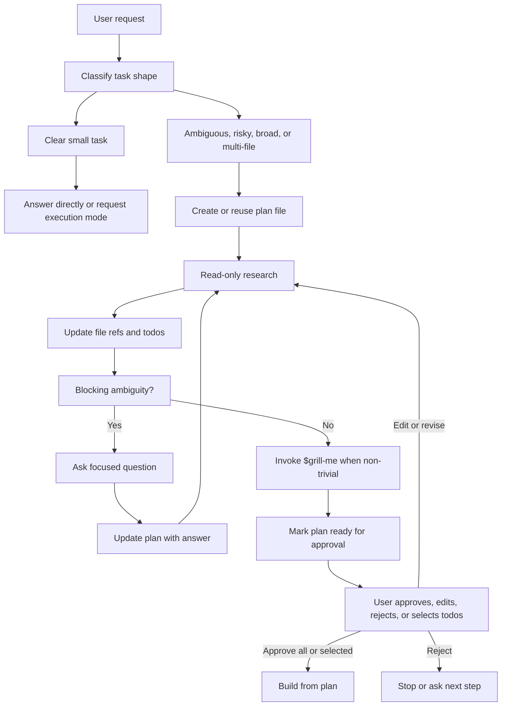

# Plan Mode Architecture

## Table Of Contents

- [Purpose](#purpose)
- [Lifecycle](#lifecycle)
- [Mode Boundary](#mode-boundary)
- [Entry Conditions](#entry-conditions)
- [Research Strategy](#research-strategy)
- [Clarification Gate](#clarification-gate)
- [Plan Creation](#plan-creation)
- [Mermaid Guidance](#mermaid-guidance)
- [Execution Handoff](#execution-handoff)
- [Common Failure Modes](#common-failure-modes)
- [Minimal Templates](#minimal-templates)

## Purpose

Plan mode is a Cursor-style planning workflow for work where premature execution can cause churn, data loss, unclear product behavior, or edits outside the user's intent. It separates planning from building: the agent creates a disk-backed editable Markdown plan, researches the codebase into that plan, asks clarifying questions, keeps file references and todos current, and builds only from the approved plan.

## Lifecycle



## Mode Boundary

The planning boundary is defined by side effects, not by effort level.

Allowed in plan mode:

- Read files and directories.
- Search code, symbols, docs, transcripts, and diagnostics.
- Inspect Git status or diffs without staging or changing anything.
- Inspect existing terminal metadata or command output.
- Use semantic search, web/docs lookup, and read-only MCP/resource tools.
- Use read-only subagents for exploration when delegation is available.
- Ask structured questions.
- Invoke `$grill-me` for pressure-testing when the plan is non-trivial.
- Produce or update a chat or platform-plan summary only after the Markdown plan file exists.
- Create or update the required Markdown plan artifact as an allowed planning write.
- Create or update `$grill-me` transcript and planning-ready outcome files when `$grill-me` is invoked.

Not allowed in plan mode:

- Edit, create, delete, move, format, or generate project files, except for allowed planning artifacts: the required Markdown plan artifact and `$grill-me` transcript/outcome files.
- Run package managers, migrations, generators, formatters, autofixers, install commands, or scripts that write output.
- Start services, browser automation, deployments, or long-running workflows unless the plan itself is about how to do that later and the action is strictly read-only.
- Stage, commit, amend, push, reset, checkout, or otherwise mutate Git state.
- Modify settings, environment files, credentials, or project configuration.
- Treat a user's approval of research as approval to implement.

If a tool can be used either read-only or mutating, choose only the read-only invocation in plan mode unless it is writing an allowed planning artifact. If the side effects are unclear, do not run it; ask or inspect documentation first.

## Entry Conditions

Use plan mode when any of these are true:

- The user explicitly asks for a plan, design, architecture, proposal, or "plan mode."
- Multiple implementation approaches have meaningful tradeoffs.
- Requirements, inputs, success criteria, or target paths are unclear.
- The task touches several files, packages, routes, data contracts, public APIs, or user-facing workflows.
- The work involves migrations, auth, payments, deployment, data deletion, generated code, or other high-blast-radius surfaces.
- The agent would otherwise need to ask several clarifying questions during implementation.

Do not force plan mode when:

- The user asks a simple factual question.
- The user asks for a single read-only command or file lookup.
- The change is trivial and already approved for execution.
- The current mode is execution and the plan has already been accepted.

## Research Strategy

Research should make the plan accurate, not exhaustive for its own sake.

1. Start with the user's stated target paths, open files, recent files, or named systems.
2. Read repository instructions and local conventions that can change the plan.
3. Map the ownership boundary: route, component, server API, data shape, config, tests, and validation path.
4. Search by behavior and naming variants before proposing a new abstraction.
5. Stop when the next decision is clear enough to plan; ask the user when code cannot answer it.

Use subagents when the codebase is large and the investigations are independent. Give each subagent:

- Objective.
- Read-only scope.
- Key constraints.
- Expected evidence: paths, snippets, findings, unknowns, and confidence.

The parent agent keeps ownership of the final plan. Subagent conclusions are inputs, not automatic decisions.

## Clarification Gate

Ask before planning when the missing answer changes the implementation materially.

Good clarification topics:

- Which product behavior is intended.
- Which target directory, package, route, account, or environment to use.
- Which tradeoff the user prefers when multiple designs are valid.
- Whether the user wants compatibility, migration, deletion, or a clean replacement.
- Whether a potentially expensive or disruptive verification step is allowed.

Avoid asking when:

- The answer is visible in the repository.
- A conventional default is obvious and low risk.
- The question only affects minor naming or formatting.

Use structured multiple choice when possible. Keep choices few, include the recommended default, and continue after the user answers.

## Plan Creation

The Markdown plan file is the approval artifact and the build input. It should be concise enough to review, editable enough for the user to change directly, and specific enough that an execution pass can build from selected todos.

Create or update a project-local Markdown plan file for every plan-mode run unless the user explicitly forbids file output or the environment cannot write files. Do not use the platform plan or chat message as the only approval artifact. They may summarize the plan after the file exists.

Use `scripts/plan_artifact.py` to create and validate the artifact:

1. Resolve the helper from the workspace copy first, then installed skill locations.
2. Run `python3 "$helper" init --workspace "$workspace_root" --title "<plan title>"`.
3. Use `--path "<path>" --reuse-existing` when the user provides a plan path.
4. Fill the plan file with file/code references, clarifying questions, editable todos, build notes, validation, and risks.
5. Run `python3 "$helper" check "$plan_file"` before asking for approval.
6. Fix missing headings or placeholders and rerun the check. If the check cannot pass, report why before requesting any implementation approval.

Before asking for approval on a non-trivial plan, invoke `$grill-me` as the pressure-test step. Use it for architecture plans, broad implementation plans, migration plans, risky operational changes, product behavior decisions, and any plan where hidden assumptions could materially change execution. Skip it only when the task is narrow, already decided, or purely mechanical.

When invoking `$grill-me`:

- Let `$grill-me` ask one logged question at a time and follow its own logging/finalization rules.
- Treat its transcript and planning-ready outcome as allowed planning artifacts.
- Do not duplicate its role with informal pressure-test questions that are not logged.
- Add transcript and outcome links to the plan. Include only a terse status or one-line summary; do not inline the full outcome content because it may be large.

For plan file placement:

- Use the user-provided path when one is given.
- Otherwise reuse an existing repository plan directory or template.
- If no convention exists, use `docs/plans/<YYYY-MM-DD>-<short-topic>.md`.
- Keep planning artifacts as the only planning-mode writes. Do not edit implementation files, generated files, settings, or Git state.
- Mark the file `Draft - awaiting approval` until the user accepts it.
- Update the same file when the plan changes after feedback.
- Cite the path in the chat response and summarize only the highest-signal points.

Include:

- Plan status and output path, when a plan file exists.
- Summary of the user goal and scope.
- Clarifying questions and answers, or explicit blockers.
- File paths, symbols, routes, schemas, docs, diagnostics, and other code references gathered during research.
- Editable todo checklist with dependencies or selected todos when relevant.
- `$grill-me` transcript and outcome paths when a pressure-test was run.
- Build-from-plan notes that state how execution should start after approval.
- Validation steps.
- Risks, tradeoffs, or assumptions that matter to approval.

Avoid:

- Unanswered questions.
- Generic task lists that do not mention concrete code areas.
- Hidden implementation choices.
- Overly detailed line-by-line instructions unless the task requires precision.
- Promises to run validations that are not available or appropriate.

When the platform provides a plan approval tool, use it only as a concise mirror of the plan file. Tool names vary by environment; use the available plan, approval, or task-planning mechanism instead of assuming a specific tool name. Treat the file as the durable source of truth.

## Mermaid Guidance

Use diagrams when they reduce complexity for architecture, data flow, routing, state transitions, or multi-system sequencing.

Follow these constraints:

- Use simple node IDs without spaces.
- Quote labels that contain punctuation.
- Avoid reserved IDs such as `end`, `graph`, or `subgraph`.
- Do not use explicit colors or custom styles.
- Do not use click events.

## Execution Handoff

Approval changes the operating mode from planning to building; it does not remove engineering judgment.

Before executing:

1. Re-read the newest user message and any plan edits.
2. Re-read the plan file from disk.
3. Confirm whether approval covers all todos or only selected todos.
4. Confirm the requested scope still matches the current repository state.
5. Preserve unrelated user changes.
6. Start with the first approved todo.

During execution:

- Keep edits scoped to the plan.
- If new evidence invalidates the plan, pause, update the plan file, and ask again.
- Do not silently expand scope.
- Validate according to the plan and repository rules.

After execution:

- Summarize what changed.
- Report validation results and any skipped checks.
- Mention unresolved risks or follow-ups that genuinely matter.

## Common Failure Modes

- Planning after already mutating files. Fix by stopping, reporting the accidental mutation, and asking how to proceed.
- Presenting only a chat or platform-plan artifact. Fix by creating or updating the Markdown plan file, validating it with `plan_artifact.py check`, and citing the path.
- Treating the plan file as a one-time export instead of a live editable document. Fix by updating the same file after research, answers, user edits, and plan revisions.
- Building without rereading user edits to the plan file. Fix by rereading the plan from disk before execution.
- Failing to invoke `$grill-me` for a plan with meaningful assumptions, tradeoffs, or failure modes. Fix by running the pressure-test before asking for implementation approval.
- Failing to create a plan file for a plan-mode run. Fix by writing or updating only the Markdown plan artifact, validating it, then citing the path.
- Asking too many questions before reading obvious context. Fix by doing a small read-only pass first.
- Creating a plan with unresolved decisions. Fix by asking the blocking question before the approval artifact.
- Delegating the entire decision to a subagent. Fix by keeping the parent responsible for synthesis and approval.
- Treating approval of a plan as approval for unrelated cleanup. Fix by keeping the execution scope narrow.
- Running validation too early when it writes files. Fix by deferring it to the approved execution plan.

## Minimal Templates

Use this structure for simple plans:

```markdown
Status: Draft - awaiting approval

## Summary

[One paragraph]

## File And Code References

- `[path]` - [why it matters]

## Plan Todos

- [ ] Inspect `[path]` to confirm `[contract]`.
- [ ] Update `[file]` to `[behavior]`.
- [ ] Verify with `[command or manual check]`.
```

Use this structure for larger plans:

```markdown
Status: Draft - awaiting approval

## Summary

[One paragraph]

## Clarifying Questions

- [x] [Question] -> [Answer]

## File And Code References

- `[path]` - [symbol, route, schema, or contract]

## Plan Todos

- [ ] [Todo with dependency or affected area]
- [ ] [Todo with dependency or affected area]

## Build From Plan

- Ready to build: No
- Selected todos: All after approval
- Execution notes: [handoff constraints]

## Validation

- [command or manual check]

## Risks

- [Only material risks]
```
