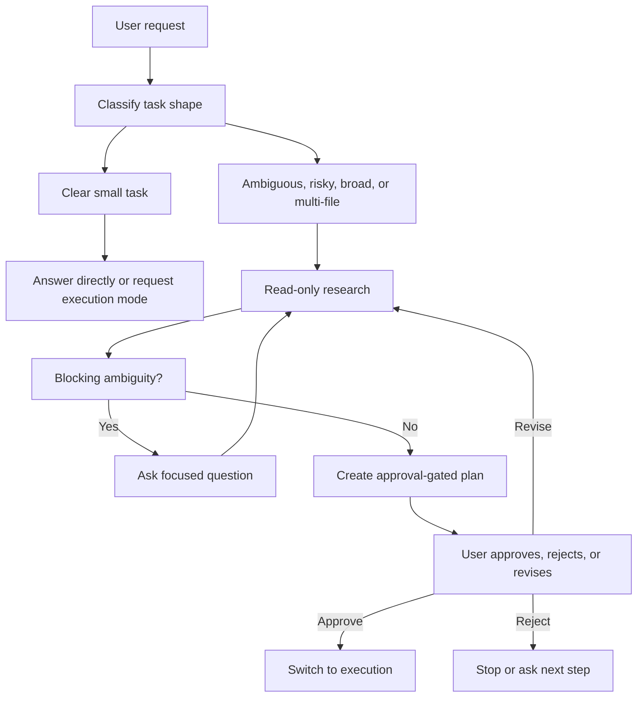

# Plan Mode Architecture

## Table Of Contents

- [Purpose](#purpose)
- [Lifecycle](#lifecycle)
- [Mode Boundary](#mode-boundary)
- [Entry Conditions](#entry-conditions)
- [Research Strategy](#research-strategy)
- [Clarification Gate](#clarification-gate)
- [Plan Creation](#plan-creation)
- [Mermaid Guidance](#mermaid-guidance)
- [Execution Handoff](#execution-handoff)
- [Common Failure Modes](#common-failure-modes)
- [Minimal Templates](#minimal-templates)

## Purpose

Plan mode is an approval-gated operating mode for work where premature execution can cause churn, data loss, unclear product behavior, or edits outside the user's intent. It separates thinking from mutation: the agent may inspect, reason, and ask, but must not change the system until the user approves a concrete plan.

## Lifecycle



## Mode Boundary

The planning boundary is defined by side effects, not by effort level.

Allowed in plan mode:

- Read files and directories.
- Search code, symbols, docs, transcripts, and diagnostics.
- Inspect Git status or diffs without staging or changing anything.
- Inspect existing terminal metadata or command output.
- Use semantic search, web/docs lookup, and read-only MCP/resource tools.
- Use read-only subagents for exploration when delegation is available.
- Ask structured questions.
- Produce or update the approval plan through the platform plan tool.

Not allowed in plan mode:

- Edit, create, delete, move, format, or generate project files.
- Run package managers, migrations, generators, formatters, autofixers, install commands, or scripts that write output.
- Start services, browser automation, deployments, or long-running workflows unless the plan itself is about how to do that later and the action is strictly read-only.
- Stage, commit, amend, push, reset, checkout, or otherwise mutate Git state.
- Modify settings, environment files, credentials, or project configuration.
- Treat a user's approval of research as approval to implement.

If a tool can be used either read-only or mutating, choose only the read-only invocation in plan mode. If the side effects are unclear, do not run it; ask or inspect documentation first.

## Entry Conditions

Use plan mode when any of these are true:

- The user explicitly asks for a plan, design, architecture, proposal, or "plan mode."
- Multiple implementation approaches have meaningful tradeoffs.
- Requirements, inputs, success criteria, or target paths are unclear.
- The task touches several files, packages, routes, data contracts, public APIs, or user-facing workflows.
- The work involves migrations, auth, payments, deployment, data deletion, generated code, or other high-blast-radius surfaces.
- The agent would otherwise need to ask several clarifying questions during implementation.

Do not force plan mode when:

- The user asks a simple factual question.
- The user asks for a single read-only command or file lookup.
- The change is trivial and already approved for execution.
- The current mode is execution and the plan has already been accepted.

## Research Strategy

Research should make the plan accurate, not exhaustive for its own sake.

1. Start with the user's stated target paths, open files, recent files, or named systems.
2. Read repository instructions and local conventions that can change the plan.
3. Map the ownership boundary: route, component, server API, data shape, config, tests, and validation path.
4. Search by behavior and naming variants before proposing a new abstraction.
5. Stop when the next decision is clear enough to plan; ask the user when code cannot answer it.

Use subagents when the codebase is large and the investigations are independent. Give each subagent:

- Objective.
- Read-only scope.
- Key constraints.
- Expected evidence: paths, snippets, findings, unknowns, and confidence.

The parent agent keeps ownership of the final plan. Subagent conclusions are inputs, not automatic decisions.

## Clarification Gate

Ask before planning when the missing answer changes the implementation materially.

Good clarification topics:

- Which product behavior is intended.
- Which target directory, package, route, account, or environment to use.
- Which tradeoff the user prefers when multiple designs are valid.
- Whether the user wants compatibility, migration, deletion, or a clean replacement.
- Whether a potentially expensive or disruptive verification step is allowed.

Avoid asking when:

- The answer is visible in the repository.
- A conventional default is obvious and low risk.
- The question only affects minor naming or formatting.

Use structured multiple choice when possible. Keep choices few, include the recommended default, and continue after the user answers.

## Plan Creation

The plan is the approval artifact. It should be concise enough to review and specific enough to execute.

Include:

- Goal and scope.
- Affected files, directories, modules, or systems.
- Ordered implementation steps.
- Validation steps.
- Non-goals or exclusions when they prevent scope creep.
- Risks, tradeoffs, or assumptions that matter to approval.

Avoid:

- Unanswered questions.
- Generic task lists that do not mention concrete code areas.
- Hidden implementation choices.
- Overly detailed line-by-line instructions unless the task requires precision.
- Promises to run validations that are not available or appropriate.

When the platform provides a plan approval tool, use it. Tool names vary by environment; use the available plan, approval, or task-planning mechanism instead of assuming a specific tool name. Otherwise, present the plan in chat and ask for explicit approval before executing.

## Mermaid Guidance

Use diagrams when they reduce complexity for architecture, data flow, routing, state transitions, or multi-system sequencing.

Follow these constraints:

- Use simple node IDs without spaces.
- Quote labels that contain punctuation.
- Avoid reserved IDs such as `end`, `graph`, or `subgraph`.
- Do not use explicit colors or custom styles.
- Do not use click events.

## Execution Handoff

Approval changes the operating mode; it does not remove engineering judgment.

Before executing:

1. Re-read the newest user message and any plan edits.
2. Confirm the requested scope still matches the current repository state.
3. Preserve unrelated user changes.
4. Start with the first approved task.

During execution:

- Keep edits scoped to the plan.
- If new evidence invalidates the plan, pause and ask or produce a revised plan.
- Do not silently expand scope.
- Validate according to the plan and repository rules.

After execution:

- Summarize what changed.
- Report validation results and any skipped checks.
- Mention unresolved risks or follow-ups that genuinely matter.

## Common Failure Modes

- Planning after already mutating files. Fix by stopping, reporting the accidental mutation, and asking how to proceed.
- Asking too many questions before reading obvious context. Fix by doing a small read-only pass first.
- Creating a plan with unresolved decisions. Fix by asking the blocking question before the approval artifact.
- Delegating the entire decision to a subagent. Fix by keeping the parent responsible for synthesis and approval.
- Treating approval of a plan as approval for unrelated cleanup. Fix by keeping the execution scope narrow.
- Running validation too early when it writes files. Fix by deferring it to the approved execution plan.

## Minimal Templates

Use this structure for simple plans:

```markdown
## Plan

1. Inspect `[path]` to confirm `[contract]`.
2. Update `[file]` to `[behavior]`.
3. Verify with `[command or manual check]`.
```

Use this structure for larger plans:

```markdown
## Goal

[One paragraph]

## Scope

- Change: `[paths]`
- Do not change: `[paths or behaviors]`

## Steps

1. [Concrete implementation step]
2. [Concrete implementation step]
3. [Validation]

## Risks

- [Only material risks]
```
